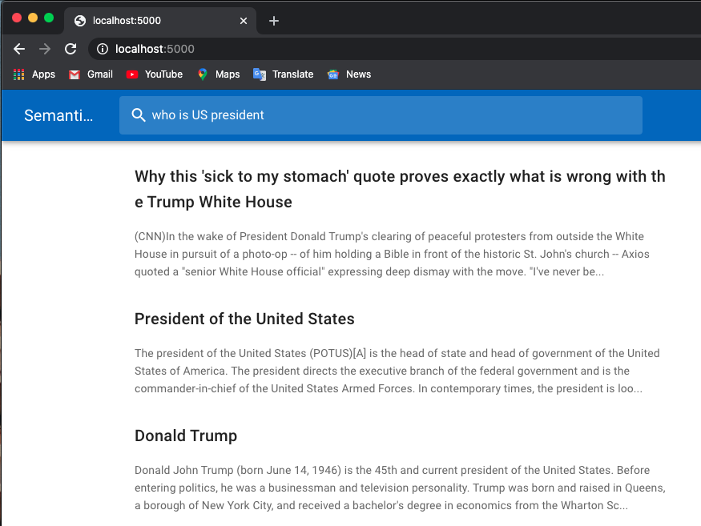
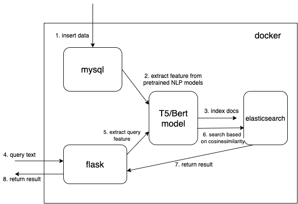
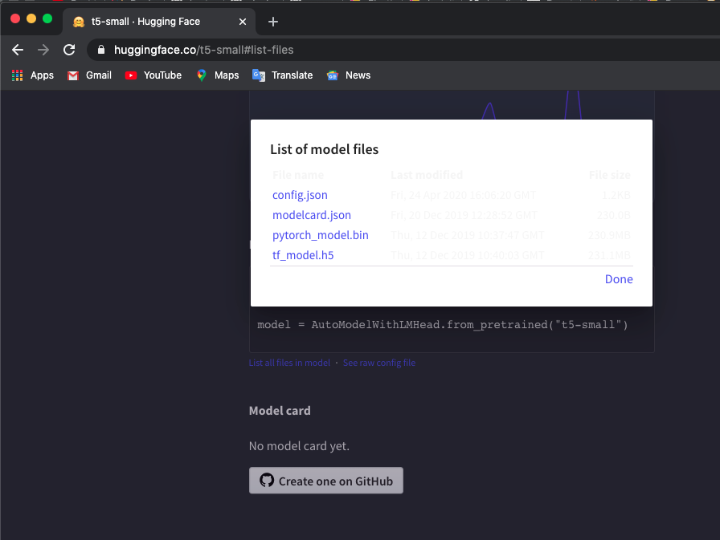
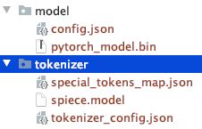

# Elasticsearch meets T5/Bert/Your favorite pretrained NLP model 

Below is a job search example:



## System architecture



I use pretrained models from [huggingface transformers](https://github.com/huggingface/transformers).
## Getting Started

### 1. Download a pretrained T5/BERT model

Manually download pretrained tokenizer and t5/bert model into local directories.You can check models [here](https://huggingface.co/models).

I use 't5-small' model, check here and click `List all files in model` to download files.


Note the manually downloaded files [directory struture](https://github.com/huggingface/transformers/issues/856).



You could use other T5 or Bert models.

### 2. Set environment variables

If you download other models, check [hugaface transformers pretraied model](https://huggingface.co/transformers/pretrained_models.html) list to check the model name.

```bash
$ export TOKEN_DIR=path_to_your_tokenizer_directory/tokenizer
$ export MODEL_DIR=path_to_your_model_directory/model
$ export MODEL_NAME=t5-small #or other model you downloaded
$ export INDEX_NAME=docsearch
```

### 3. Run Docker containers

```bash
$ docker-compose up --build
```
I also use `docker system prune` to remove all unused containers, networks and images to get more memory. Increase your docker memory (I use `8GB`) if you encounter `Container exits with non-zero exit code 137` error.


### 4. Create index
We use [dense vector datatype](https://www.elastic.co/guide/en/elasticsearch/reference/current/dense-vector.html) to save the extracted features from pretrained NLP models (t5 or bert here, but you can add your interested [pretrained models](https://huggingface.co/transformers/pretrained_models.html) by yourself)


```json
{
  ...
  "text_vector": {
    "type": "dense_vector",
    "dims": 512
  }
  ...
}
```
**Dimensions** `dims:512` is for T5 models. Change `dims` to 768 if you use Bert models.

### 6. Index documents

Read doc from mysql and convert document into [correct json format](https://elasticsearch-py.readthedocs.io/en/master/helpers.html) to [bulk](https://www.elastic.co/guide/en/elasticsearch/reference/current/docs-bulk.html) into elasticsearch.

```bash
$ cd index_files
$ pip install -r requirements.txt
$ python indexing_files.py
# or you can customize your parameters
# $ python indexing_files.py --index_file='index.json' --index_name='docsearch' --data='documents.jsonl'
```

### 7. Open browser

Go to <http://127.0.0.1:5000>.

## Customize your favoirte model
The key code for use pretrained model to extract features is `get_emb` function in `./index_files/indexing_files.py` and `./web/app.py` files.

```python
def get_emb(inputs_list,model_name,max_length=512):
    if 't5' in model_name: #T5 models, written in pytorch
        tokenizer = T5Tokenizer.from_pretrained(TOKEN_DIR)
        model = T5Model.from_pretrained(MODEL_DIR)
        inputs = tokenizer.batch_encode_plus(inputs_list, max_length=max_length, pad_to_max_length=True,return_tensors="pt")
        outputs = model(input_ids=inputs['input_ids'], decoder_input_ids=inputs['input_ids'])
        last_hidden_states = torch.mean(outputs[0], dim=1)
        return last_hidden_states.tolist()

    elif 'bert' in model_name: #Bert models, written in tensorlow
        tokenizer = BertTokenizer.from_pretrained('bert-base-multilingual-cased')
        model = TFBertModel.from_pretrained('bert-base-multilingual-cased')
        batch_encoding = tokenizer.batch_encode_plus(["this is","the second","the thrid"], max_length=max_length, pad_to_max_length=True)

        outputs = model(tf.convert_to_tensor(batch_encoding['input_ids']))
        embeddings = tf.reduce_mean(outputs[0],1)
        return embeddings.numpy().tolist()
```

You can change the code and use your favorite pretrained model. For example, you can use [GPT2 model](https://huggingface.co/transformers/model_doc/gpt2.html#tfgpt2model).

## Customize your Elasticsearch
you can also customize your elasticsearch by [using your own score function](https://www.elastic.co/guide/en/elasticsearch/reference/current/query-dsl-script-score-query.html) instead of ` cosineSimilarity` in `.\web\app.py`.

## Based-on
This rep is modified based on [Hironsan/bertsearch](https://github.com/Hironsan/bertsearch), which use `bert-serving` packages to extract bert features. It limits to TF1.x
